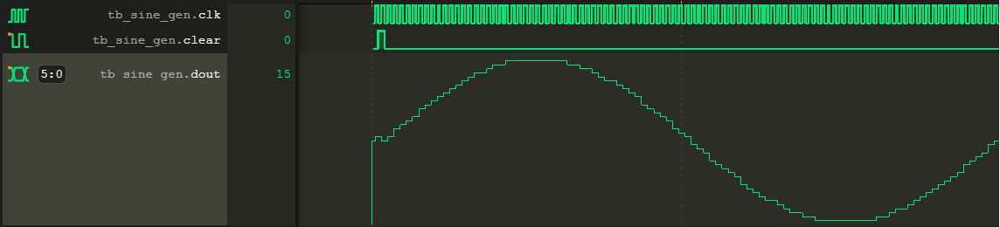
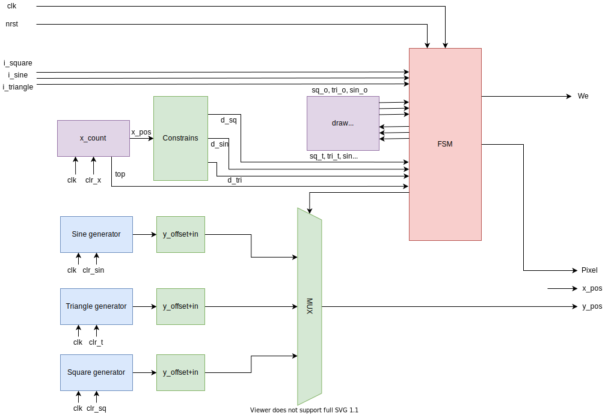

# S7_DSD_Neural_Network
The S7 Project to design a neural network in Quartus. The input requires an audio signal, and the output is a VGA signal, to represent several patterns in the audio signal.

## Target board
The project is developed for the DE1-SOC development board from Intel. The data acquisition is performed using the _WM8731_ audio codec, and the VGA output is driven by the _ADV7123_ video DAC.

The processing is performed using the CYCLONE V SOC. Every computation is performed with the FPGA.

## MyHDL
The video driver and the neural network are written in Python with MyHDL (located in the _myhdl_ folder).

This module gives the opportunity to use
native commands which are related to VHDL/Verilog code, but with the ease of Python.

A great example of using Python is the following:

``` python
def func(i: int, n_samples: int) -> int:
  return int(127 + math.sin(2 * math.pi / n_samples * i))

samples_lst = [func(i) for i in range(n_samples)]
samples = tuple(samples_lst)
```

A tuple with a sine wave is created above. MyHDL sees it as a constant array and therefore, it will create ROM (Read Only Memory) for it. The VHDL output will be a big `switch case` statement, containing the sine wave.

While simulating this example, the result is as follows:


## Total design
#TODO(Total design)

## Data acquisition
The audio signal is captured with the audio codec, in the form of 2 times 24 bits of information. This contains the left and right audio signal. Only one side of the information is used for the 

## Video design
The top level video design includes a VGA driver. The VGA driver has the following features:
- 640x480 VGA resolutions
- 60 Hz refresh rate
- 80x60 video buffer
- Monochrome color input
- Up to 50 Mbit/s data transfer rate

### FSM and data path


The schematic above shows the FSM (Finite State Machine) and the data path. Three wave form generators are used to create a square, triangle and sine wave. The wave form that is displayed is chosen by the FSM, using the MUX (Multiplexer).

The X counter runs from the left to the right side of the buffer and on every X position it places a pixel on the corresponding Y coordinate, created by a wave form generator.

The lifespan of the memory used in the VGA driver is increased by only updating changes to the screen. This is done by using the _draw memory_.

If a change in the input occurs, compared to the draw memory, the FSM calls the generators to update the screen.
